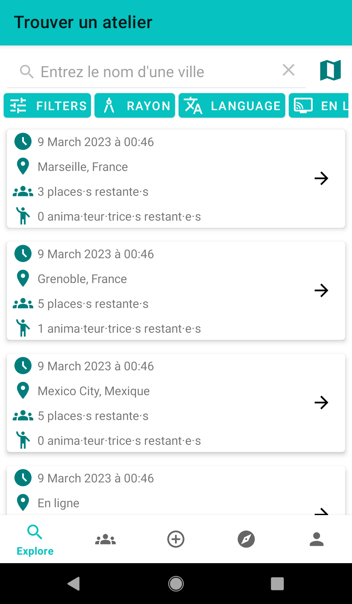
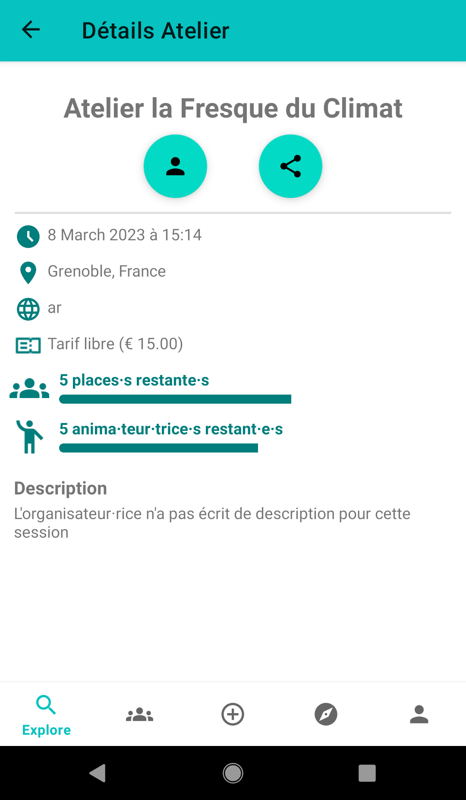
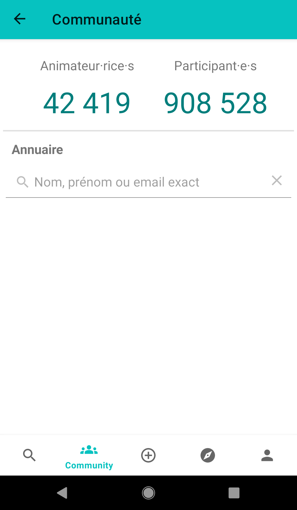
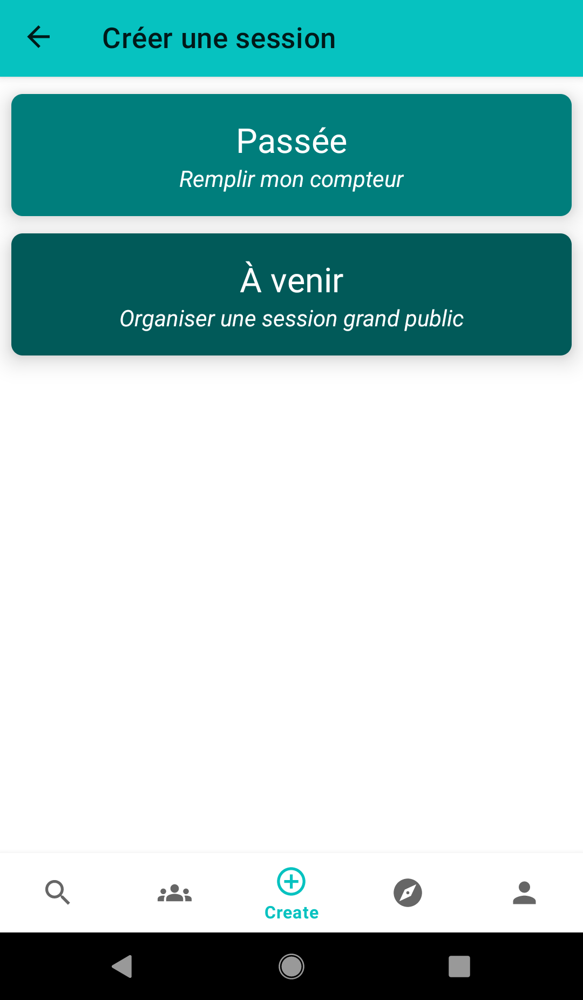
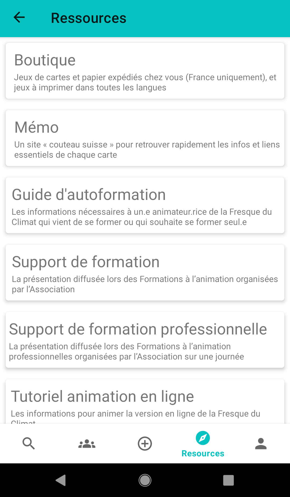
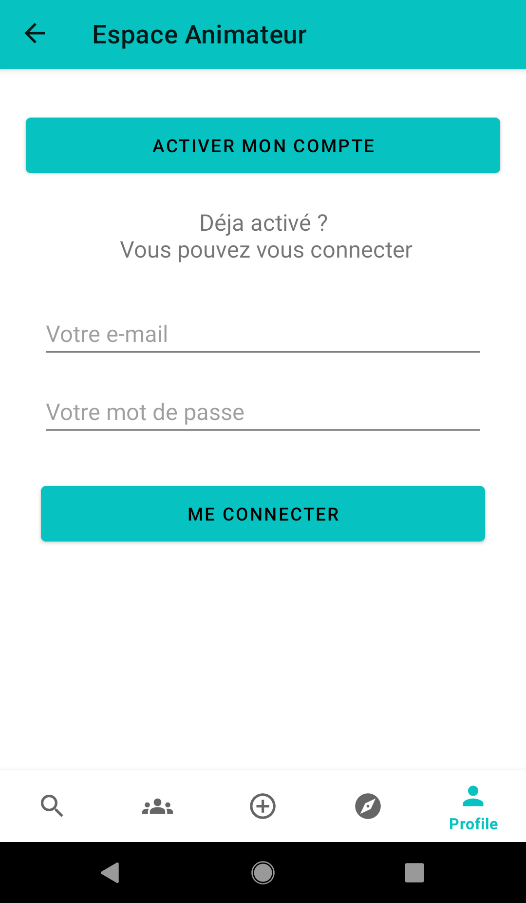
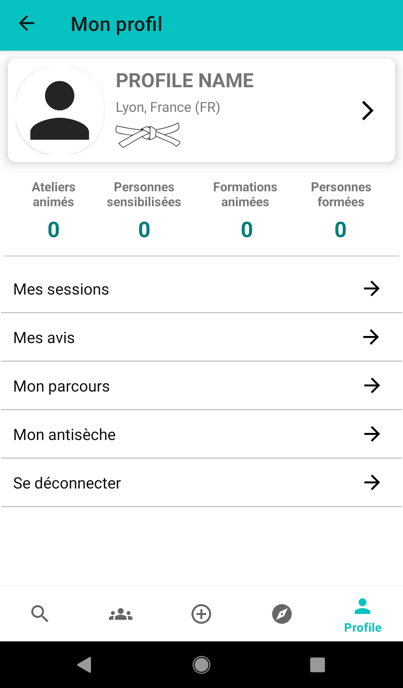

# Fresque Climat Animateur

Ce projet s'inspire fortement du site web de la Fresque du Climat à des fins de développement 
et de démonstration, en utilisant des données factices.

Veuillez noter qu'il ne s'agit en aucun cas d'une affiliation, d'une endorsement ou d'une copie 
officielle du site web de la Fresque du Climat : https://association.climatefresk.org/

Toutes les marques de commerce et droits d'auteur associés au site web appartiennent à leurs propriétaires respectifs.

## Description

Cette application est principalement un outil à destination des animateurs de la Fresque du Climat.
Une fois connecté sur son espace personnel, l'animateur est en mesure de : 
- Trouver un atelier existant pour pouvoir s'inscrire en tant que (co-)animateur ou observateur
- Créer/organiser un atelier grand public
- Remplir son compteur de fresques personnel et visualiser son parcours de fresqueur
- Accéder aux ressources internes de l'association
- Créer une antisèche d'animation personnelle 
- Tester ses connaissances à l'aide du quizz animateur
- Accéder au compteur global de participants et d'animateurs
- Chercher un membre de l'association dans l'annuaire public

L'appli permet également aux personnes qui ne sont pas animatrices de trouver un atelier de libre pour pouvoir s'y inscrire et y participer.

## Dependencies 

les composants et librairies suivantes ont été utilisées pour développer cette appli:
- MVVM + LiveData + Data Binding
- Navigation + Safe Args
- Dagger Hilt (Dependency Injection)
- Room Database

## Screenshots

### Recherche d'ateliers existants
Cet écran permet à l'animateur de chercher une session existante sur laquelle il peut s'inscrire.
Plusieurs filtres sont disponibles permettant réduire le nombre de résultats selon les préférences. 

 

### Détails d'un atelier existant
Cet écran apparaît lorsque l'animateur clique sur un atelier existant lors de la recherche.
Il permet de visualiser la date, le lieu, la langue, le tarif, la description, l'auteur ainsi que 
le nombre de participants et animateurs disponibles restants pour cet atelier.

 

### Communauté
Cet écran permet de visualiser en direct le compteur global des animateurs et participants de la Fresque.
Un annuaire permet également de rechercher un "fresqueur" sur le réseau de l'association (si son compte est public).

 

### Créer une nouvelle session
Cet écran permet, soit la création d'un nouvel atelier de la Fresque du climat, soit de remplir son compteur personnel d'ateliers.

 

### Ressources internes
Cet écran permet un accès direct aux ressources internes de l'association destinées à l'animateur (wiki, mémo, supports, etc)

 

### Connexion à l'espace animateur
Cet écran permet à l'animateur de rentrer ses identifiants afin de se connecter à son espace personnel d'animateur de la fresque.

 

### Espace animateur
Cet écran est la page principale de l'espace animateur, il permet à l'animateur de 
- visualiser et/ou modifier ses informations personnelles
- gérer l'organisation de ses ateliers à venir
- visualiser son parcours de fresqueur
- créer/personnaliser son antisèche d'animation
- se déconnecter de son espace
- 
 