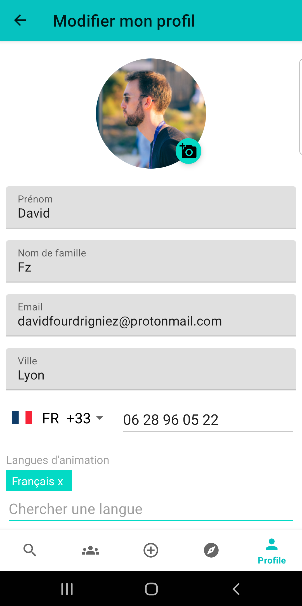

# Fresque Climat Animateur

Ce projet s'inspire du site web de la Fresque du Climat à des fins de développement 
et de démonstration, en utilisant des données factices.

Cette application est actuellement en phase de prototypage et nous vous invitons à la tester et à nous faire part de vos retours d'expérience.

Veuillez noter qu'il ne s'agit en aucun cas d'une affiliation, d'une endorsement ou d'une copie 
officielle du site web de la Fresque du Climat : https://association.climatefresk.org/

Toutes les marques de commerce et droits d'auteur associés au site web appartiennent à leurs propriétaires respectifs.

## Description

Cette application est principalement un outil à destination des animateurs de la Fresque du Climat.
Une fois connecté sur son espace personnel, l'animateur est en mesure de : 
- Trouver un atelier existant pour pouvoir s'inscrire en tant que (co-)animateur ou observateur
- Créer/organiser un atelier grand public
- Remplir son compteur de fresques personnel et visualiser son parcours de fresqueur
- Accéder aux ressources internes de l'association
- Créer une antisèche d'animation personnelle 
- Tester ses connaissances à l'aide du quizz animateur
- Accéder au compteur global de participants et d'animateurs
- Chercher un membre de l'association dans l'annuaire public

L'appli permet également aux personnes qui ne sont pas animatrices de trouver un atelier de libre pour pouvoir s'y inscrire et y participer.

## Dépendances 

les composants et librairies suivantes ont été utilisées pour développer cette appli:
- MVVM + LiveData + Data Binding
- Navigation + Safe Args
- Dagger Hilt (Dependency Injection)
- Room Database

## Guide d'installation

### Prérequis

Avant de commencer, assurez-vous d'avoir les éléments suivants :
- Un smartphone Android fonctionnel
- Accès au dépôt GitHub de l'application

### Installation

1. Téléchargez la dernière version de l'application à partir de la section "Releases" de ce dépôt GitHub.
2. Sur votre appareil Android, accédez aux paramètres de sécurité et activez l'option "Sources inconnues" ou "Installation à partir de sources inconnues". Cela vous permettra d'installer des applications depuis des sources autres que le Google Play Store.
3. Ouvrez le fichier APK téléchargé depuis votre gestionnaire de fichiers ou depuis la barre de notifications.
4. Suivez les instructions à l'écran pour installer l'application.
5. Une fois l'installation terminée, vous pouvez ouvrir l'application en appuyant sur son icône dans le lanceur d'applications de votre appareil.

### Remarques

- Cette version de l'application est une version de prototypage et peut contenir des bugs ou des fonctionnalités non finalisées. Veuillez être conscient de cela avant de l'installer et de l'utiliser.
- Nous vous encourageons vivement à nous faire part de vos retours d'expérience, notamment en signalant tout bug que vous rencontrez ou toute suggestion d'amélioration que vous pourriez avoir. Vous pouvez soumettre des problèmes via la section "Issues" de ce dépôt GitHub.

## Guide d'utilisation

### Recherche d'ateliers existants
Cet écran permet à l'animateur de chercher une session existante à laquelle il peut s'inscrire.
Plusieurs filtres sont disponibles permettant de réduire le nombre de résultats selon les préférences. 

 

### Détails d'un atelier existant
Cet écran apparaît lorsque l'animateur clique sur un atelier existant lors de la recherche.
Il permet de visualiser la date, le lieu, la langue, le prix, la description, l'auteur ainsi que le nombre de participants et animateurs disponibles restants pour cet atelier.

 

### Communauté
Cet écran permet de visualiser en direct le compteur global des animateurs et participants de la Fresque.
Un annuaire permet également de rechercher un "fresqueur" sur le réseau de l'association (si son compte est public).

 

### Créer une nouvelle session
Cet écran permet, soit la création d'un nouvel atelier de la Fresque du climat, soit de remplir son compteur personnel d'ateliers.

 

### Ressources internes
Cet écran permet un accès direct aux ressources internes de l'association destinées à l'animateur (wiki, mémo, supports, etc)

 

### Connexion à l'espace animateur
Cet écran permet à l'animateur de rentrer ses identifiants afin de se connecter à son espace personnel d'animateur de la fresque.

 

### Espace animateur
Cet écran est la page principale de l'espace animateur, il permet à l'animateur d'avoir un aperçu de son profil et son parcours de fresqueur ainsi que de gérer ses sessions d'animation passées et à venir
Une fonctionnalité de personnalisation d'antisèche d'animation est actuellement en cours de développement (voir roadmap).

  

## Roadmap

- visualisation des sessions publiques disponibles à venir au sein d'une carte géographique
- visualisation et/ou modification de ses informations personnelles dans l'espace animateur
- visualiser son parcours de fresqueur avec explication des prérequis pour accécer à chaque ceinture (blanche, orange, bleue, etc)
- avoir accès au mémo des différentes cartes du jeu avec l'explication des liens possibles d'une carte avec les autres
- créer et personnaliser son antisèche d'animation
